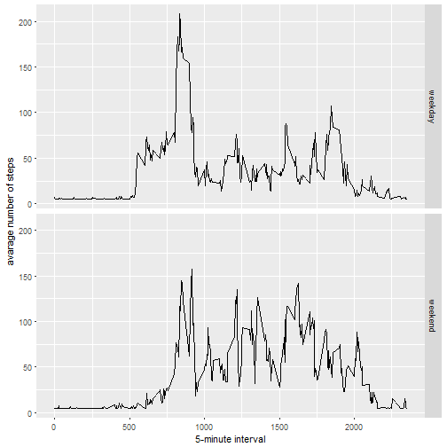

```r
library(ggplot2)
library(Hmisc)
```

##Loading Dataset 


```r
Actdata<-read.csv("activity.csv")
head(Actdata)
```

```
##   steps       date interval
## 1    NA 2012-10-01        0
## 2    NA 2012-10-01        5
## 3    NA 2012-10-01       10
## 4    NA 2012-10-01       15
## 5    NA 2012-10-01       20
## 6    NA 2012-10-01       25
```

##Q1-What is the mean total number of steps taken per day

###1.1 Calculate total number of steps taken per day


```r
stepsperday<-tapply(Actdata$steps,Actdata$date,sum,na.rm=TRUE)
```

###1.2 Histogram of total number of steps taken each day


```r
hist(stepsperday,xlab = "Number of Steps", ylab = "Number of Days", main="Histogram of Steps/Day", breaks = 10 )
```


###1.3 Mean and Median of the Total Number of Steps Taken per day


```r
meanstepsperday<-mean(stepsperday)
medianstepsperday<-median(stepsperday)
print(meanstepsperday)
```

```
## [1] 9354.23
```

```r
print(medianstepsperday)
```

```
## [1] 10395
```

##Q2-What is the Average daily activity pattern?

###2.1 Time Series Plot of 5 min interval vs average number of steps taken accross all days


```r
stepsperinterval<-aggregate(list(steps=Actdata$steps),list(interval=Actdata$interval),mean,na.rm=TRUE)
plot(stepsperinterval,type="l", xlab="Interval", ylab="Number of Steps", main="Time Series Plot")
```


###2.2 5 minute interval that contains maximum steps averaged accross all days


```r
maxstepsinterval<-stepsperinterval[which.max(stepsperinterval$steps),]
print(maxstepsinterval)
```

```
##     interval    steps
## 104      835 206.1698
```

##Q3- Input Missing values in the data

###3.1 Calculate and report the total number of missing values in the dataset 


```r
missingdata<-sum(is.na(Actdata$steps))
print(missingdata)
```

```
## [1] 2304
```

###3.2 New dataset with imputed missing values


```r
newActdata<-Actdata
newActdata$steps<-impute(Actdata$steps,mean)
head(newActdata)
```

```
##     steps       date interval
## 1 37.3826 2012-10-01        0
## 2 37.3826 2012-10-01        5
## 3 37.3826 2012-10-01       10
## 4 37.3826 2012-10-01       15
## 5 37.3826 2012-10-01       20
## 6 37.3826 2012-10-01       25
```

###3.3 Histogram of total number of steps taken per day and updated mean & median

```r
newstepsperday<-tapply(newActdata$steps,newActdata$date,sum)
hist(newstepsperday,xlab = "Number of Steps", ylab = "Number of Days", main="Histogram of Steps/Day (After Imputing Missing Values)")
```


```r
newmeanstepsperday<-mean(newstepsperday)
newmedianstepsperday<-median(newstepsperday)
print(newmeanstepsperday)
```

```
## [1] 10766.19
```

```r
print(newmedianstepsperday)
```

```
## [1] 10766.19
```

#### NoTE: We do see and increase in the mean and the median once we fill the missing values

##Q4- Are there differences in activity patterns between weekdays and weekends?

###4.1  a new factor variable in the dataset with two levels - "weekday" and "weekend" indicating whether a given date is a weekday or weekend day.

```r
newActdata$typeofday<-ifelse(as.POSIXlt(newActdata$date)$wday %in% c(0,6),"weekend","weekday")
head(newActdata)
```

```
##     steps       date interval typeofday
## 1 37.3826 2012-10-01        0   weekday
## 2 37.3826 2012-10-01        5   weekday
## 3 37.3826 2012-10-01       10   weekday
## 4 37.3826 2012-10-01       15   weekday
## 5 37.3826 2012-10-01       20   weekday
## 6 37.3826 2012-10-01       25   weekday
```

###4.2 Panel time series plot comparing weekdays and weekends

```r
newstepsperinterval<-aggregate(list(steps=newActdata$steps),list(interval=newActdata$interval,typeofday=newActdata$typeofday),mean,na.rm=TRUE)
ggplot(newstepsperinterval, aes(interval, steps)) + 
  geom_line() + 
  facet_grid(typeofday ~ .) +
  xlab("5-minute interval") + 
  ylab("avarage number of steps")
```




